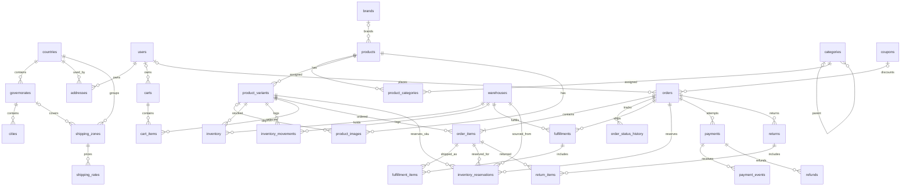

# Classic Store — ERD

```mermaid
erDiagram
  countries ||--o{ governorates : contains
  governorates ||--o{ cities : contains
  countries ||--o{ addresses : used_by
  users ||--o{ addresses : owns
  users o|--o{ carts : owns
  users o|--o{ orders : places
  brands o|--o{ products : brands
  categories o|--o{ categories : parent
  products ||--o{ product_categories : assigned
  categories ||--o{ product_categories : assigned
  products ||--o{ product_variants : has
  products ||--o{ product_images : has
  product_variants o|--o{ product_images : depicts
  warehouses ||--o{ inventory : holds
  product_variants ||--o{ inventory : stocked
  warehouses ||--o{ inventory_movements : logs
  product_variants ||--o{ inventory_movements : logs
  carts ||--o{ cart_items : contains
  product_variants ||--o{ cart_items : selected
  orders ||--|{ order_items : contains
  product_variants ||--o{ order_items : ordered
  coupons o|--o{ orders : discounts
  orders ||--o{ order_status_history : tracks
  orders ||--o{ fulfillments : ships
  warehouses ||--o{ fulfillments : fulfills
  fulfillments ||--o{ fulfillment_items : includes
  order_items ||--o{ fulfillment_items : shipped_as
  orders ||--o{ inventory_reservations : reserves
  order_items ||--o{ inventory_reservations : reserved_for
  warehouses ||--o{ inventory_reservations : sourced_from
  product_variants ||--o{ inventory_reservations : reserves_sku
  orders ||--o{ payments : attempts
  payments ||--o{ payment_events : receives
  payments ||--o{ refunds : refunds
  countries ||--o{ shipping_zones : groups
  governorates o|--o{ shipping_zones : covers
  shipping_zones ||--o{ shipping_rates : prices
  orders ||--o{ returns : returns
  returns ||--o{ return_items : includes
  order_items ||--o{ return_items : returned
```

`settings` و`outbox_events` جداول مستقلة. `inventory_movements.actor_user_id` و`order_status_history.changed_by` يرتبطان اختياريًا بـ`users`.
